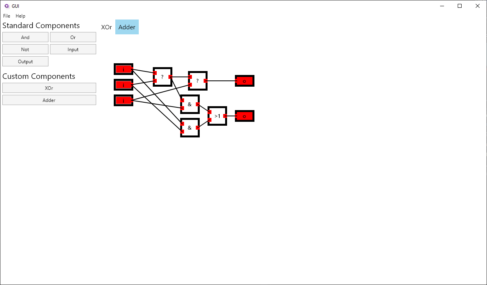

# DigiFlisp

A *nicer* alternative to DigiFlisp

Written in C#

## Showcase

Now with all the functionality from the Java clone.  
Download it from the [releases tab](./releases).

## TODO

* [ ] GUI: Delete components
* [ ] GUI: Replace components
* [ ] Export to OG DigiFlisp file format